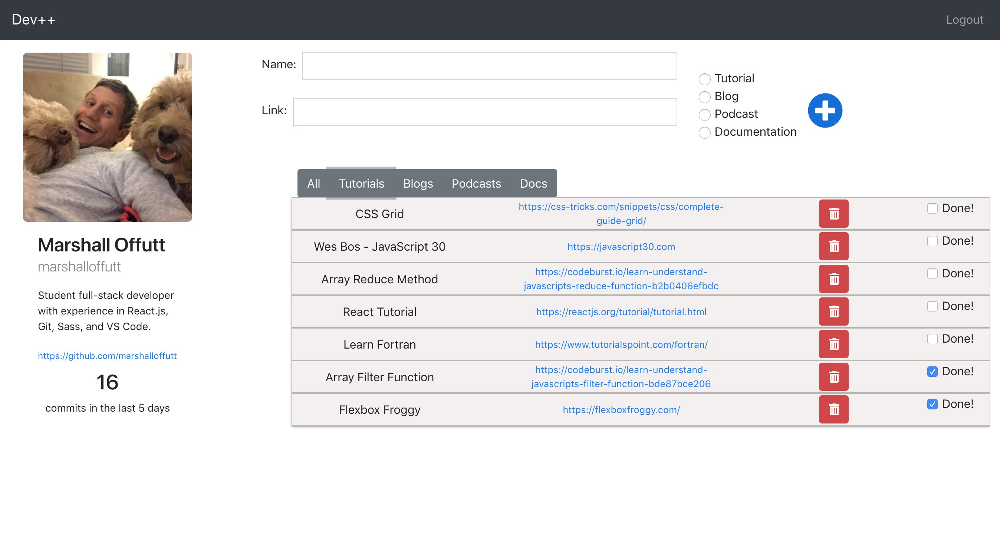

# Dev++

## Description

This app is a tool for junior developers to keep track of resources they are interested in. It is essentially a to-do list app, but also uses the GitHub API to display profile, and commits count. User can sort resources by type, and can also add new resources, or delete unwanted resources.

## Screenshot

## Technologies Used
* React
* Sass
* Axios
* Create-React-App
* Reactstrap

## How to run this app
Note: To run this app you will need a firebase account and a new project.

### 1. Configure Firebase
1. Clone the repository to your local machine.
2. Run the following command in terminal to download the web dependencies: `npm install`
3. In the db folder, rename apiKeys.json.example to apiKeys.json.
4. In Firebase, create a new project.
5. Navigate to your config object, and copy the keys from Firebase into the apiKeys.json file.
6. Create a realtime databse in Firebase, and start in test mode.

### 2. Serve up the app
#### `npm start`

Runs the app in the development mode. 
Open [http://localhost:3000](http://localhost:3000) to view it in the browser.
